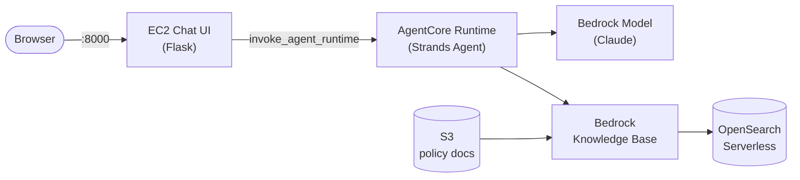

# Metro Grand Mall Support Agent — Strands + Bedrock AgentCore + Knowledge Base

An end-to-end, Terraform-deployed reference stack: a Flask chat UI on EC2 talks
to a Strands agent running on Bedrock AgentCore Runtime, which answers
customer-support questions by retrieving from a Bedrock Knowledge Base backed
by OpenSearch Serverless.

Full architecture diagrams, module/IAM reference tables, and a deep-dive
troubleshooting log live in [`docs/`](docs/):
- [`docs/ARCHITECTURE.md`](docs/ARCHITECTURE.md) — component diagram, request-flow sequence diagram, module table, IAM roles, configuration reference
- [`docs/TROUBLESHOOTING.md`](docs/TROUBLESHOOTING.md) — real issues hit deploying this stack, and their fixes



## Is an AgentCore Gateway needed?

**No, not for this architecture.** AgentCore Gateway is for exposing external
APIs/Lambdas/services as MCP tools that an agent (or multiple agents/clients) can
call. Here, the Strands agent talks to the Bedrock Knowledge Base directly using
the `BedrockKnowledgeBaseStore` memory store (calls the Bedrock `Retrieve` API via
the standard AWS SDK/credential chain from inside the AgentCore Runtime container).
No Gateway, no extra hop, no extra resource to manage. If you later want to expose
this knowledge base (or other tools) to *other* agents/clients over MCP, that's
when a Gateway becomes useful — it is not included here.

## What gets deployed

| Layer | Resource(s) | Module |
|---|---|---|
| Networking | VPC, 2 public subnets, IGW, route table, security group | `modules/networking` |
| Source docs | S3 bucket + 5 sample policy documents (auto-uploaded) | `modules/s3_knowledge_source` |
| Vector store | OpenSearch Serverless collection + policies + vector index | `modules/opensearch_vectorstore` |
| Knowledge Base | Bedrock Knowledge Base (VECTOR) + S3 data source + auto ingestion job | `modules/bedrock_knowledge_base` |
| Agent image | ECR repo + `docker buildx` build/push (linux/arm64) | `modules/ecr_agent_image` |
| Agent runtime | Bedrock AgentCore Runtime (container-based) + IAM role | `modules/agentcore_runtime` |
| Chat UI | EC2 instance running a Flask app as a systemd service | `modules/ec2_chat_ui` |

See [`docs/ARCHITECTURE.md`](docs/ARCHITECTURE.md) for the full diagram, IAM roles per component, and the complete configuration reference.

## Prerequisites

On the machine that runs `terraform apply`:

1. **Terraform** >= 1.7 (`.terraform-version` pins `1.7.0`)
2. **AWS CLI v2**, configured with credentials that can create IAM roles, S3,
   OpenSearch Serverless, Bedrock, ECR, EC2, and VPC resources
3. **Docker** (with `buildx`) — used to build and push the ARM64 agent image.
   No Docker Desktop admin rights? See the Colima setup in
   [`docs/TROUBLESHOOTING.md`](docs/TROUBLESHOOTING.md#no-docker--docker-desktop-needs-admin-rights).
4. Bedrock model access enabled in the target region for:
   - `amazon.titan-embed-text-v2:0` (embeddings)
   - The chat model referenced by `bedrock_model_id` (default: a Claude
     Sonnet cross-region inference profile)
   Enable these under **Bedrock console → Model access** before applying.
5. A region where **Bedrock AgentCore, Bedrock Knowledge Bases, and OpenSearch
   Serverless** are all available (defaults to `us-east-1`).

## Spin up

```bash
cp terraform.tfvars.example terraform.tfvars
# edit terraform.tfvars: at minimum, restrict allowed_chat_ui_cidrs to your IP

terraform init
terraform apply
```

At the end, Terraform prints:

```
chat_ui_url = "http://<ec2-public-ip>:8000"
```

Open that URL and start chatting — try "What is your return policy?" or
"How long do refunds take?".

### Known one-time quirk (OpenSearch Serverless + Terraform)

The `opensearch` provider is configured using the OpenSearch Serverless
collection's endpoint, which is only known once that collection is created —
a value only available *during* apply, not at plan time. On a brand-new
account/collection, this can occasionally cause the **first** `terraform
apply` to fail while creating the vector index resource. **Simply re-run
`terraform apply`** — it will pick up right where it left off and succeed.
This is a well-documented ordering quirk in the Terraform/OpenSearch
Serverless ecosystem, not specific to this configuration.

### Other things Terraform does for you automatically

- Uploads all files in `sample_data/` to the S3 bucket and triggers a
  Bedrock Knowledge Base ingestion job whenever those files change
  (`null_resource` + AWS CLI, since Terraform has no native ingestion-job
  resource).
- Builds and pushes the agent's Docker image to ECR whenever
  `agent_app/` changes (`null_resource` + `docker buildx`).
- Installs Python, Flask, and boto3 on the EC2 instance via `user_data`
  and runs the chat UI as a `systemd` service (`chat-ui.service`), so it
  survives reboots and restarts automatically on failure.

## Customizing

- **Model**: change `bedrock_model_id` in `terraform.tfvars` to any Bedrock
  chat model/inference profile you have access to.
- **Documents**: drop more `.txt`/`.md` files into `sample_data/` before
  applying (or upload more objects to the `policies/` prefix afterward and
  re-run `terraform apply` to trigger a re-sync).
- **Chat UI port / instance size**: `chat_ui_port`, `ec2_instance_type`.
- **Locking down access**: set `allowed_chat_ui_cidrs` to your IP(s) instead
  of `0.0.0.0/0`, and leave `allowed_ssh_cidrs` empty to manage the instance
  only via AWS Systems Manager Session Manager (already wired up via IAM) —
  or set `ec2_key_pair_name` + `allowed_ssh_cidrs` for real SSH access. See
  [`docs/TROUBLESHOOTING.md`](docs/TROUBLESHOOTING.md#connecting-to-the-ec2-instance)
  for both options in detail.

## Destroy

```bash
terraform destroy
```

The ECR repo has `force_delete = true` and the vector index has
`force_destroy = true` so `destroy` doesn't get stuck on non-empty resources.

Before re-`apply`-ing after a `destroy` (or after any unexpected state where
`terraform plan` shows far more resources to create than you expect), verify
against AWS directly rather than assuming the state file is accurate — see
[`docs/TROUBLESHOOTING.md`](docs/TROUBLESHOOTING.md#terraform-state-went-unexpectedly-empty).

## Troubleshooting

Hit an error deploying or running this stack? Check
[`docs/TROUBLESHOOTING.md`](docs/TROUBLESHOOTING.md) first — it covers, in
order of how you're likely to hit them: provider/init errors, the
OpenSearch first-apply quirk, S3 bucket creation hangs, Docker-without-Desktop
setup, retired/inaccessible Bedrock models, cross-region inference-profile IAM
gaps, the chat UI crash-looping, and EC2 access (SSM vs. SSH).

## Cost note

The main ongoing costs are the OpenSearch Serverless collection (billed in
OCUs, has a minimum), the EC2 instance, and Bedrock on-demand inference /
embedding calls. This is sized as a demo/dev stack, not tuned for
production cost or scale.
