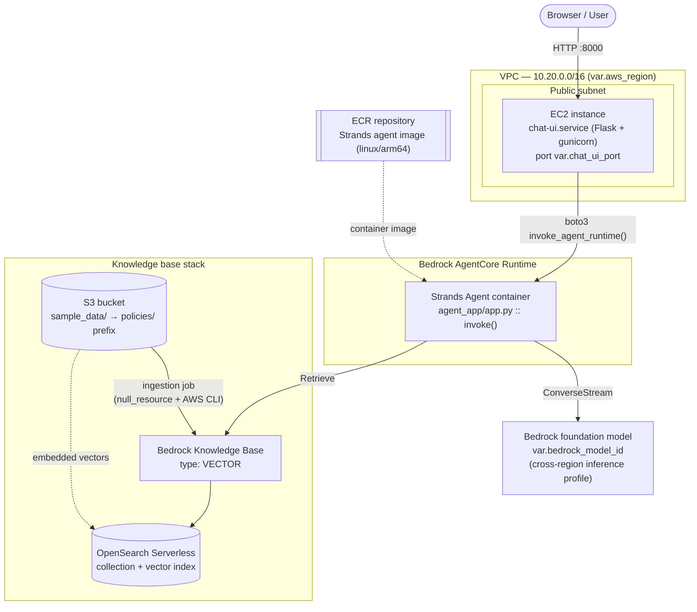
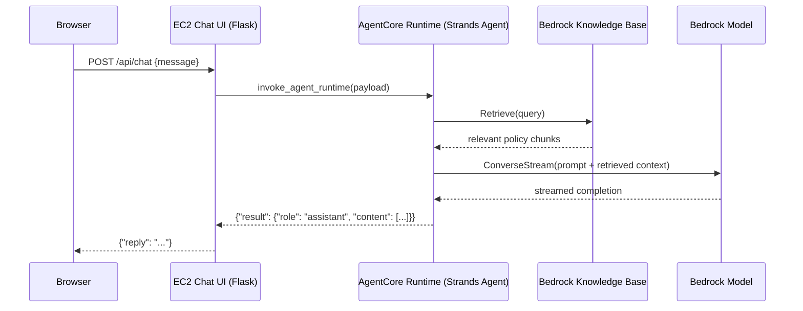

# Architecture

## Component diagram

## Request flow

## Modules and what they create

| Layer | Resource(s) | Module | Depends on |
|---|---|---|---|
| Networking | VPC, 2 public subnets, IGW, route table, security group | `modules/networking` | — |
| Source docs | S3 bucket + sample policy documents (auto-uploaded) | `modules/s3_knowledge_source` | — |
| Vector store | OpenSearch Serverless collection, security/access policies, vector index | `modules/opensearch_vectorstore` | `bedrock_knowledge_base` (for the access policy principal) |
| Knowledge Base | Bedrock Knowledge Base (VECTOR) + S3 data source + auto ingestion job | `modules/bedrock_knowledge_base` | `opensearch_vectorstore`, `knowledge_source` |
| Agent image | ECR repo + `docker buildx build --push` (linux/arm64) | `modules/ecr_agent_image` | — |
| Agent runtime | Bedrock AgentCore Runtime (container-based) + IAM role | `modules/agentcore_runtime` | `ecr_agent_image`, `bedrock_knowledge_base` |
| Chat UI | EC2 instance running the Flask app as a systemd service | `modules/ec2_chat_ui` | `networking`, `agentcore_runtime` |

Note the one deliberate near-cycle: `opensearch_vectorstore` takes `module.bedrock_knowledge_base.role_arn` (just the KB's IAM role ARN, independent of the collection) so it can grant that role data-plane access to the collection, while `bedrock_knowledge_base` in turn takes `opensearch_vectorstore`'s collection/index outputs. Terraform resolves this at the resource level without a real cycle because the IAM role resource itself has no dependency back on the collection.

## IAM roles

| Role | Attached to | Key permissions |
|---|---|---|
| `<project>-chat-ui-role` | EC2 instance | `bedrock-agentcore:InvokeAgentRuntime` on the runtime ARN; `AmazonSSMManagedInstanceCore` (Session Manager access, no SSH key needed) |
| `<agent_runtime_name>-runtime-role` | AgentCore Runtime | `bedrock:InvokeModel`/`InvokeModelWithResponseStream` on `foundation-model/*` (all regions — required because cross-region inference profiles route to whichever region has capacity) and `inference-profile/*`; `bedrock:Retrieve`/`RetrieveAndGenerate` on the KB; ECR pull; CloudWatch Logs; X-Ray |
| `<project>-kb-role` | Bedrock Knowledge Base | `bedrock:InvokeModel` on the embedding model only; `aoss:APIAccessAll` on the OpenSearch Serverless collection; `s3:GetObject`/`ListBucket` on the source bucket |

## Configuration reference (`variables.tf`)

| Variable | Default | Purpose |
|---|---|---|
| `aws_region` | `us-east-1` | Must support Bedrock AgentCore, Bedrock Knowledge Bases, and OpenSearch Serverless together |
| `project_name` | `mall-support-agent` | Prefix for every resource name |
| `mall_name` | `Metro Grand Mall` | Shown in the chat UI |
| `vpc_cidr` | `10.20.0.0/16` | VPC CIDR |
| `public_subnet_cidrs` | `["10.20.1.0/24", "10.20.2.0/24"]` | Public subnets (2 AZs) |
| `allowed_chat_ui_cidrs` | `["0.0.0.0/0"]` | CIDRs allowed to reach the chat UI on `chat_ui_port` |
| `allowed_ssh_cidrs` | `[]` | CIDRs allowed on port 22; empty means SSH is closed (use SSM instead) |
| `ec2_key_pair_name` | `null` | Existing EC2 key pair for SSH; changing this **replaces** the instance (`key_name` is set only at launch) |
| `ec2_instance_type` | `t3.small` | Chat UI instance size |
| `chat_ui_port` | `8000` | Port the Flask app listens on |
| `embedding_model_id` | `amazon.titan-embed-text-v2:0` | Bedrock embedding model |
| `embedding_dimension` | `1024` | Must match the embedding model and the OpenSearch vector field |
| `bedrock_model_id` | `us.anthropic.claude-sonnet-5` | Chat model / cross-region inference profile used by the Strands agent |
| `tags` | `{}` | Extra tags merged into every resource |

## Cost note

The main ongoing costs are the OpenSearch Serverless collection (billed in OCUs, has a minimum), the EC2 instance, and Bedrock on-demand inference/embedding calls. This stack is sized as a demo/POC, not tuned for production cost or scale.
